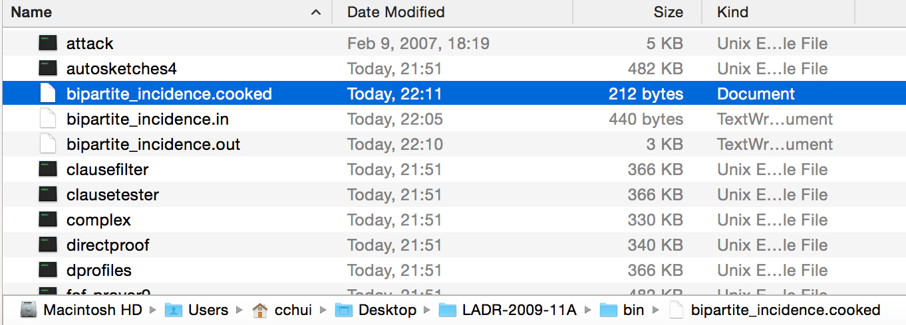

[Home](./)

## Prover9 CLI Instructions

# Using Command-Line Versions of Prover9 and Mace4

There is a lot more information in the official manual for both programs, but here are some condensed notes on how to use the command-line versions. (Full manual: [https://www.cs.unm.edu/~mccune/prover9/manual/2009-11A/](https://www.cs.unm.edu/~mccune/prover9/manual/2009-11A/))

## Compilation & Installation

1. Download the Prover9 source files (LADR-2009-11A.tar.gz) from the website onto your Desktop:
[https://www.cs.unm.edu/~mccune/prover9/download/](https://www.cs.unm.edu/~mccune/prover9/download/)
2. Unzip the files to your Desktop by double-clicking the zip file.
3. Open Terminal in Mac.

4. Navigate to the unzipped folder and then use the 'make all' command to compile the files:
```shell
cd Desktop
cd LADR-2009-11A
make all
```

(It make take a minute or two to compile.)

Once done compiling, it will prompt you to run the software tests (to make sure everything is ok).
```shell
make test1
make test2
make test3
```

4. Once it is done, it indicates that the binary files you need are found in the `/bin` folder.

5. In Terminal, give permissions to the folder to be able to run the binaries:
```shell
chmod -R +x bin
```
6. Finally, navigate to inside the `/bin` folder:
```shell
cd bin
```


## Prover9
1. Keep Terminal open -- you will need to use Terminal to use the command-line version of Prover9.
Commands are of the following format.

```shell
./prover9 [-h] [-x] [-p] [-t <n>] [-f <files>]

  -h         Help.  Also see http://www.cs.unm.edu/~mccune/prover9/
  -x         set(auto2).  (enhanced auto mode)
  -p         Fully parenthesize output.
  -t n       assign(max_seconds, n).  (overrides ordinary input)
  -f files   Take input from files instead of from standard input.
```
2. Your Prover9 input file will need to look like the screenshot below -- use a text editor like TextEdit or an editor of your choice (note: **never Microsoft Word**).

Your ontology should be placed between  the `formula(assumptions).` and `end_of_list.` tags.
3.  Put the goal in between the `formula(goals).` and `end_of_list.` tags.

```shell
formulas(assumptions).

all x all y (in(x,y) -> in(y,x)).
all x (in(x,x)).
all p (point(p) -> -line(p)).
all x all y ((in(x,y) & point(x) & point(y)) -> (x=y)).
all x all y ((in(x,y) & line(x) & line(y)) -> (x=y)).
all p (point(p) -> (exists l 	(line(l) 	& in(p,l)))).
all l (line(l) -> (exists p (point(p) & in(p,l)))).
(exists p exists l (point(p) & line(l) & in(p,l))).

end_of_list.

formulas(goals).

% add your goal here

end_of_list.
```

(In this example, we have no goal.)
4. Save the file and name it in the `*.in` format.
5. To run Prover9, you will need to issue the following command:

```shell
./prover9 -t 60 -f bipartite_incidence.in > bipartite_incidence.out
```
Time limit is 60 seconds, it takes in a file called `bipartite_incidence.in` and outputs to a file called `bipartite_incidence.out`.

6. The following output messages will be displayed in Terminal:
* `SEARCH FAILED` = no proof
* `THEOREM PROVED` = proof found
7. If you open the output file, you will see the output of whether or not a proof was generated.

8. If a proof was generated, check the `PROOF` section. (If there's no proof, check the statistics section and you'll see that `proofs=0`.)


## Mace4

1.  In Terminal, to run Mace4, the commands are of this format:

```shell
./mace4 [-t <n>] [-n <k>] [-m <z>] [-f <files>]

  -t n       assign(max_seconds, n).  (overrides ordinary input)
  -n k       domain_size(k)
  -m z       max_models(z)
  -f files   Take input from files instead of from standard input.
```
In this example, we ask Mace4 to search for:
* up to 10 models of domain size 2 or more, 
* with a time limit of 60 seconds, 
* using the file `bipartite_incidence_in`, and 
* writing the output to `bipartite_incidence.out`.

```shell
./mace4 -t 60 -n 2 -m 10 -f bipartite_incidence.in > bipartite_incidence.out
```
Normally we don't need to specify the domain size or model limit, so you can also use the command in this format:

```shell
./mace4 -t 60 -f bipartite_incidence.in > bipartite_incidence.out
```

Note: you can also name the model output as `.model` if you want to distinguish your proof output files from the model output files.

```shell
./mace4 -t 60 -n 2 -m 10 -f bipartite_incidence.in > bipartite_incidence.model
./mace4 -t 60 -f bipartite_incidence.in > bipartite_incidence.model
```
2. Open the output file in your editor of choice and the output will be found in the `MODEL` section.


## Cooking Models in Command Line
1. The model output is not very readable, in order to cook it, you will also have to do this in the Terminal.  There is an `interpformat` binary also in the folder.  You can use it to convert the model output.  The commands are of this format with the following options for converting models:
```shell
./interpformat standard  -f x2.mace4.out > x2.standard
./interpformat standard2 -f x2.mace4.out > x2.standard2
./interpformat portable  -f x2.mace4.out > x2.portable
./interpformat tabular   -f x2.mace4.out > x2.tabular
./interpformat raw       -f x2.mace4.out > x2.raw
./interpformat cooked    -f x2.mace4.out > x2.cooked
./interpformat xml       -f x2.mace4.out > x2.xml
./interpformat tex       -f x2.mace4.out > x2.tex
```
2.  We are only interested in **cooked** models so we don't need to look at the other settings.
3.  With our example, we want to cook the bipartite_incidence model output.  We can do it using this command.
```shell
./interpformat cooked -f bipartite_incidence.out > bipartite_incidence.cooked
```

4. Check your folder for the `bipartite_incidence.cooked`.

5.  Open the cooked model file and you will see that the model has been cooked.
